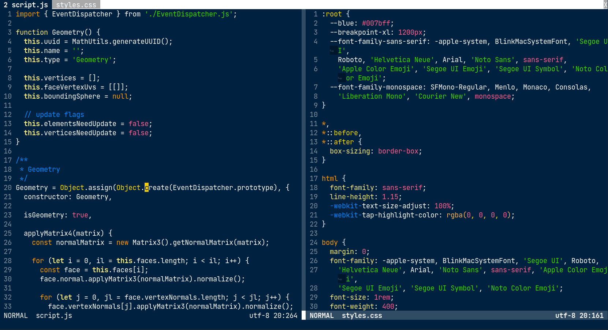

# cobaltino.vim

One more Cobalt theme for vim. Yay!

## Preview



## Installation

With `vim-plug` manager:

```
Plug 'greqov/cobaltino.vim'
```

Or copy `cobaltino.vim` to `~/.vim/colors` directory.

## Credits

- Original: [sfsekaran/cobalt.vim](https://github.com/sfsekaran/cobalt.vim)
